# NetGuard System Architecture

**Team 18** — Automated Network Security Analysis and Risk Scoring for Infrastructure-as-Code Pipelines

---

## Table of Contents

1. [Problem Statement](#problem-statement)
2. [Solution Overview](#solution-overview)
3. [System Architecture](#system-architecture)
4. [Microservices Deep Dive](#microservices-deep-dive)
5. [Data Flow & Orchestration](#data-flow--orchestration)
6. [Failure Systems & Resilience](#failure-systems--resilience)
7. [Database Schema](#database-schema)
8. [CI/CD Integration](#cicd-integration)
9. [Technology Stack](#technology-stack)
10. [Deployment Architecture](#deployment-architecture)

---

## Problem Statement

### The Challenge

Modern cloud infrastructure is increasingly defined as code (IaC) using tools like Terraform and Kubernetes manifests. However, misconfigurations in these definitions can lead to critical security vulnerabilities:

- **SSH/RDP ports exposed to the public internet** (0.0.0.0/0)
- **Databases accessible without proper network policies**
- **Overly permissive IAM policies and security groups**
- **Privileged containers running without restrictions**
- **Missing encryption on storage resources**
- **Supply chain risks** (mutable Docker images, missing dependency locks)
- **Cross-resource attack paths** that emerge from the interaction of multiple resources

Traditional security scanning tools operate in isolation, checking individual resources without understanding:
- How resources interconnect to form network topologies
- What the blast radius of a vulnerable resource is
- How changes in a Pull Request alter the overall security posture
- Which compliance frameworks are violated

### The Risk

These misconfigurations can lead to:
- Data breaches and unauthorized access
- Compliance violations (CIS, NIST, PCI-DSS, SOC2)
- Lateral movement and privilege escalation attacks
- Supply chain compromises
- Significant financial and reputational damage

### What Makes This Hard

1. **Context is Everything**: A security group rule isn't inherently bad, but becomes critical when it exposes a production database to the internet
2. **Change Detection**: Identifying what *new* risks a PR introduces requires comparing graph topologies before and after changes
3. **False Positives**: Generic rules produce noise; AI-enrichment and override mechanisms are needed
4. **Actionability**: Teams need specific, validated fix proposals, not just alerts
5. **CI/CD Integration**: Security must be enforced automatically at PR time, not after deployment

---

## Solution Overview

**NetGuard** is a comprehensive IaC security analysis platform that:

1. **Parses** Terraform and Kubernetes configurations into a normalized resource model
2. **Builds** directed network topology graphs showing resource relationships and dependencies
3. **Diffs** graphs at PR-level to identify new vs. existing security findings
4. **Scores** findings using deterministic rules + AI enrichment (Gemini LLM)
5. **Computes** blast radius showing how many resources are reachable from vulnerable nodes
6. **Generates** automated fix proposals with validation and regression testing
7. **Enforces** merge blocking for critical findings via GitHub Actions
8. **Tracks** compliance mapping to CIS, NIST, PCI-DSS, SOC2 frameworks
9. **Provides** override mechanisms for accepted risks with audit trails
10. **Visualizes** everything through an interactive React dashboard with D3.js graphs

---

## System Architecture

### High-Level Architecture Diagram

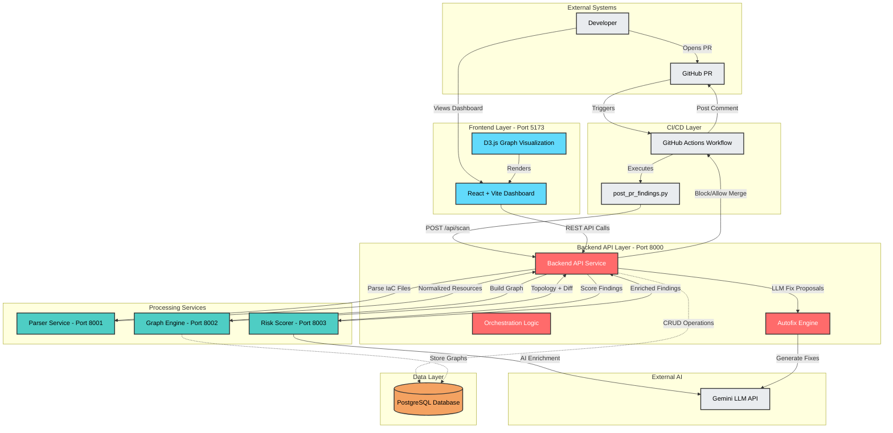

### Architecture Components

| Component | Port | Technology | Purpose |
|-----------|------|------------|---------|
| **Backend API** | 8000 | FastAPI, Python 3.12 | Orchestrates all services, persists data, serves frontend, handles autofix |
| **Parser Service** | 8001 | FastAPI, Python 3.12 | Parses `.tf` and `.yaml` IaC files into normalized JSON resources |
| **Graph Engine Service** | 8002 | FastAPI, NetworkX | Builds topology graphs, performs PR-level diffs, computes blast radius |
| **Risk Scorer Service** | 8003 | FastAPI, Gemini LLM | Rule-based + AI scoring, compliance mapping, override application |
| **Frontend** | 5173 | React 18, Vite, D3.js | Interactive dashboard with graph visualization and finding management |
| **PostgreSQL** | 5432 | PostgreSQL 14 | Persistent storage for scans, graphs, findings, overrides, evaluations |
| **GitHub Actions** | - | CI/CD | Automated PR scanning, merge blocking, comment posting |

---

## Microservices Deep Dive

### 1. Parser Service (Port 8001)

**Purpose**: Transform raw IaC files into a normalized, vendor-agnostic resource representation.

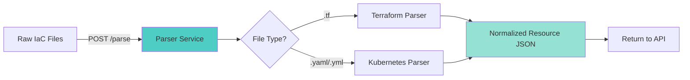

**Key Features**:
- **Terraform Parsing**: Extracts security groups, instances, S3 buckets, IAM policies, VPCs, subnets, RDS databases
- **Kubernetes Parsing**: Extracts pods, deployments, services, network policies, service accounts
- **Normalization**: Converts vendor-specific syntax into a unified schema with fields like:
  - `resource_id`: Unique identifier
  - `resource_type`: Category (e.g., `aws_security_group`, `kubernetes_pod`)
  - `resource_name`: Human-readable name
  - `attributes`: Resource-specific properties (ports, CIDR blocks, policies, etc.)
  - `source_file`: Original file path for traceability

**Technology**:
- Python 3.12, FastAPI
- Custom regex-based parsers (non-HCL, direct text parsing for flexibility)
- Pydantic models for schema validation

**Endpoints**:
- `GET /health`: Service health check
- `POST /parse`: Main parsing endpoint accepting `{files: {path: content}}`

---

### 2. Graph Engine Service (Port 8002)

**Purpose**: Build network topology graphs from normalized resources and perform PR-level diffing.

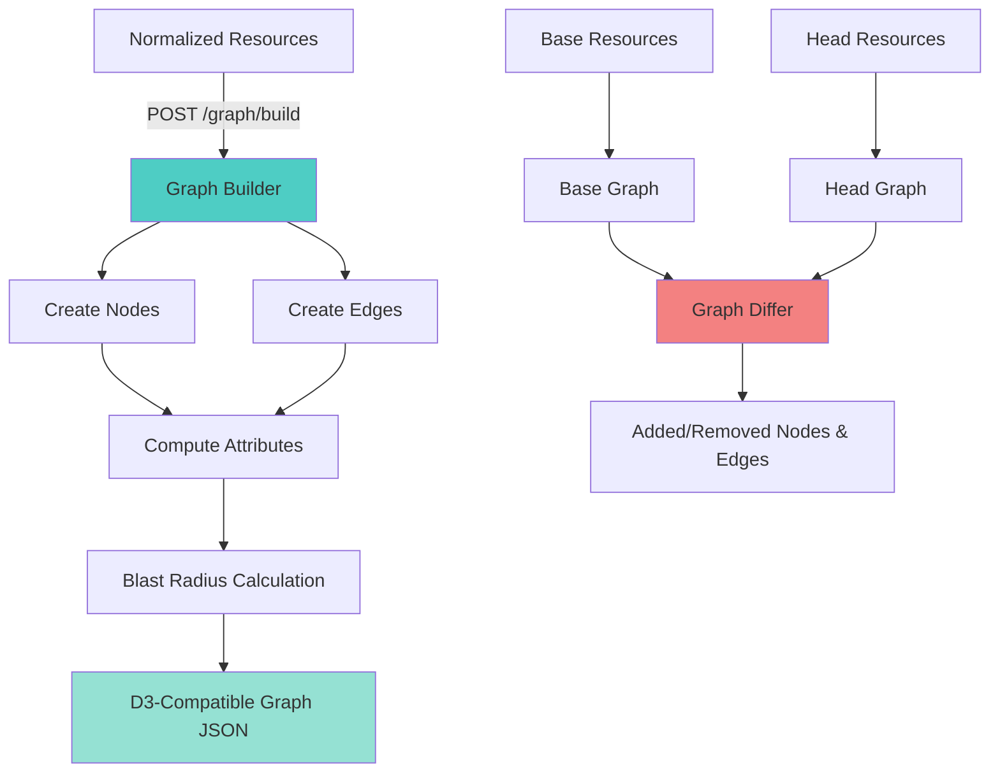

**Key Features**:
1. **Graph Construction**:
   - Nodes represent resources (VPCs, subnets, instances, databases, S3 buckets, Kubernetes pods/services)
   - Edges represent relationships (network connectivity, data flow, trust relationships)
   - Attributes include severity, exposure level, connectivity info

2. **Blast Radius Computation**:
   - For each node, compute all reachable nodes via directed edges
   - Stored as `{count: N, resources: [list]}` on each node
   - Critical for understanding the impact of a compromised resource

3. **PR-Level Graph Diffing**:
   - Compares base branch graph vs. PR head graph
   - Identifies `added_nodes`, `removed_nodes`, `added_edges`, `removed_edges`
   - Enables detection of *new* security findings introduced by the PR

4. **Subgraph Extraction**:
   - Extract neighborhood around a specific resource (N-hop subgraph)
   - Useful for focused visualization and analysis

**Technology**:
- Python 3.12, FastAPI
- NetworkX for graph data structures and algorithms
- PostgreSQL JSONB for graph persistence

**Endpoints**:
- `POST /graph/build`: Build graph from resources
- `POST /graph/diff`: Diff two resource sets
- `POST /graph/store`: Build and persist graph to DB
- `GET /graph/{graph_id}`: Retrieve stored graph
- `POST /graph/blast-radius`: Get blast radius for a node
- `POST /graph/subgraph`: Extract N-hop neighborhood
- `POST /graph/neighbors`: Get immediate predecessors/successors

---

### 3. Risk Scorer Service (Port 8003)

**Purpose**: Analyze resources for security findings using deterministic rules + AI enrichment.

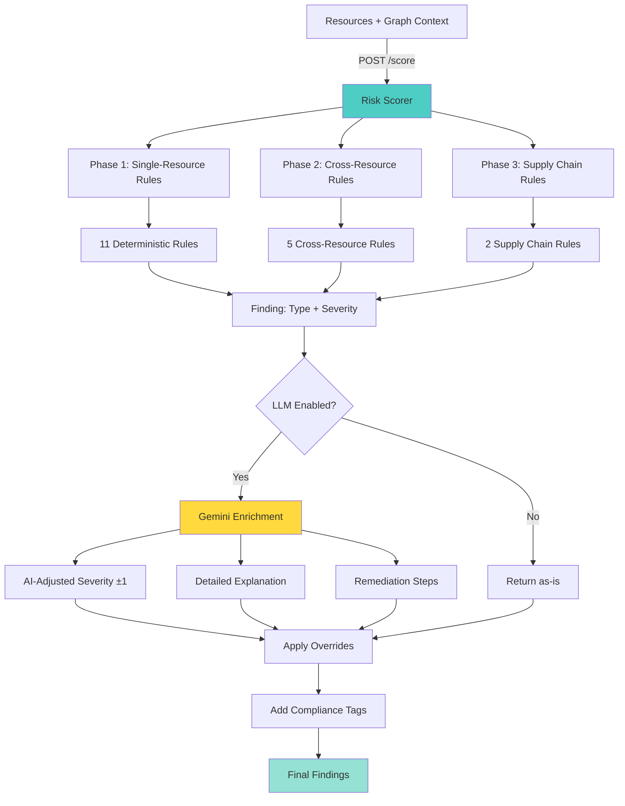

**Finding Types**:

**Single-Resource Rules** (11):
1. `SSH_EXPOSED_TO_PUBLIC` - Port 22 open to 0.0.0.0/0
2. `RDP_EXPOSED_TO_PUBLIC` - Port 3389 open to 0.0.0.0/0
3. `PUBLIC_DB_PORT_EXPOSED` - Database ports (3306, 5432, etc.) open to 0.0.0.0/0
4. `ALL_PORTS_OPEN` - Port range 0-65535 open to 0.0.0.0/0
5. `HTTP_WITHOUT_HTTPS` - HTTP (80) without HTTPS (443)
6. `PUBLIC_S3_BUCKET` - S3 bucket with public access
7. `PERMISSIVE_IAM_POLICY` - IAM policy with `*` actions or resources
8. `UNENCRYPTED_STORAGE` - RDS/S3 without encryption
9. `MISSING_NETWORK_POLICY` - Kubernetes namespace without NetworkPolicy
10. `PRIVILEGED_CONTAINER` - Kubernetes pod with `privileged: true` or `hostNetwork: true`
11. `UNAUTHENTICATED_SERVICE` - Kubernetes Service type=LoadBalancer without authentication

**Cross-Resource Rules** (5):
1. `INTERNET_EXPOSED_ADMIN_EC2` - EC2 with SSH/RDP from internet
2. `PRIVILEGED_EC2_TO_SENSITIVE_DB` - Internet-exposed EC2 can reach database
3. `PUBLIC_CHAIN_TO_DATABASE` - Multi-hop path from internet to database
4. `OVERPERMISSIVE_SG_CHAIN` - Security group chain allowing unintended access
5. `LATERAL_MOVEMENT_VIA_SG` - Multiple resources in same permissive security group

**Supply Chain Rules** (2):
1. `MUTABLE_DOCKER_IMAGE` - Container image using `:latest` or no tag
2. `MISSING_DEPENDENCY_LOCK` - Missing or stale dependency lock files

**Severity Levels**:
- `CRITICAL`: Immediate exploitability, direct data breach risk (default base score, LLM can adjust to HIGH)
- `HIGH`: Significant risk requiring prompt attention (LLM can adjust ±1)
- `MEDIUM`: Moderate risk, should be addressed (LLM can adjust ±1)
- `LOW`: Minor issue, informational (LLM can adjust to MEDIUM)

**AI Enrichment** (via Gemini LLM):
- Adjusts severity ±1 level based on context
- Generates detailed 2-3 sentence explanations
- Provides specific remediation steps
- Considers resource attributes, graph connectivity, and blast radius

**Compliance Mapping**:
Each finding is tagged with violated compliance frameworks:
- `CIS_AWS`: CIS Amazon Web Services Foundations Benchmark
- `NIST_AC`: NIST Access Control (AC family)
- `NIST_SC`: NIST System and Communications Protection (SC family)
- `NIST_SA`: NIST System and Services Acquisition (SA family)
- `PCI_DSS`: Payment Card Industry Data Security Standard
- `SOC2_CC`: SOC 2 Common Criteria

**Override System**:
- Allows teams to accept risks with justification
- Pattern-based matching (resource ID patterns)
- Severity overrides or complete suppression
- Audit trail with creator, timestamp, justification

**Technology**:
- Python 3.12, FastAPI
- Gemini 2.5 Flash API (via `google-generativeai` SDK)
- JSON-mode structured output for LLM responses
- Deterministic rules as primary source of truth, LLM as enrichment layer

**Endpoints**:
- `POST /score`: Main scoring endpoint

---

### 4. Backend API Service (Port 8000)

**Purpose**: Orchestrate all services, manage database persistence, serve frontend, handle autofix workflows.

**Key Responsibilities**:

1. **Orchestration**:
   - Receives scan requests from GitHub Actions or UI
   - Calls Parser → Graph Engine → Risk Scorer in sequence
   - Aggregates results and persists to database

2. **Scan Management**:
   - Creates repository and scan records
   - Stores IaC file snapshots for autofix
   - Tracks scan status (pending → complete/failed)
   - Maintains resolution summaries

3. **Autofix Engine**:
   - **Deterministic Fixes**: Rule-based transformations for common findings (SSH/RDP restriction, encryption enablement, tag addition)
   - **LLM-Powered Fixes**: Generates complex fixes using Gemini
   - **Validation Pipeline**:
     - Syntax validation (Terraform parsing)
     - Security group rule block validation
     - Regression testing (rescore patched files, ensure no new findings)
   - **GitHub Integration**: Posts diff previews as PR comments (when `GITHUB_TOKEN` is set)

4. **Finding Management**:
   - CRUD operations for findings
   - Override application and tracking
   - Blast radius enrichment
   - Compliance tag assignment
   - New vs. existing finding detection (via graph diff)

5. **Frontend API**:
   - Serve scan history
   - Provide graph data for visualization
   - Expose finding details with blast radius
   - Manage override rules

**Autofix Workflow**:

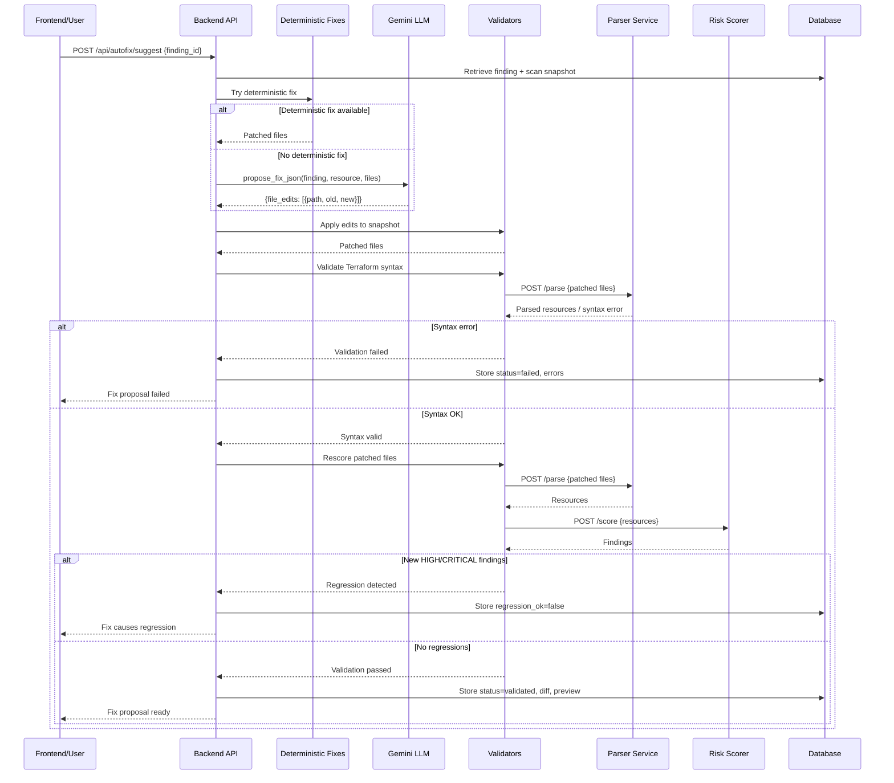

**Technology**:
- Python 3.12, FastAPI
- SQLAlchemy ORM for database operations
- httpx for async HTTP calls to downstream services
- HMAC signature verification for webhook security
- python-dotenv for environment configuration

**Key Endpoints**:
- `POST /api/scan`: Trigger a full scan (parse → graph → score)
- `GET /api/scans`: List all scans with pagination
- `GET /api/scans/{scan_id}`: Get scan details
- `GET /api/scans/{scan_id}/findings`: Get findings for a scan
- `GET /api/scans/{scan_id}/graph`: Get graph visualization data
- `POST /api/autofix/suggest`: Generate fix proposal for a finding
- `GET /api/autofix/proposals/{proposal_id}`: Get fix proposal details
- `POST /api/overrides`: Create override rule
- `GET /api/overrides`: List active overrides
- `PUT /api/overrides/{override_id}/deactivate`: Deactivate override
- `POST /api/evaluations`: Submit evaluation metrics for a scan

---

### 5. Frontend (Port 5173)

**Purpose**: Provide an interactive dashboard for security teams to visualize, analyze, and manage findings.

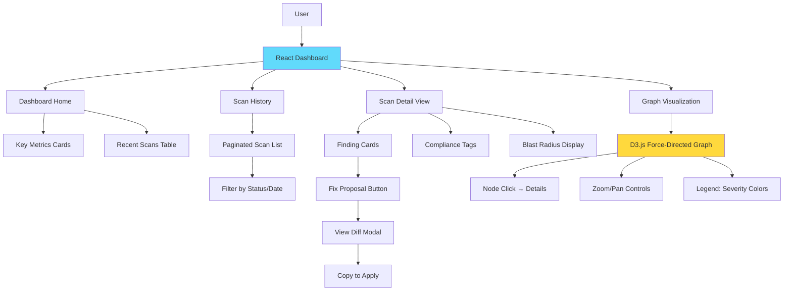

**Key Features**:

1. **Dashboard Home**:
   - Total scans, findings, repositories
   - Severity breakdown (Critical/High/Medium/Low counts)
   - Recent scan activity
   - Quick actions (trigger scan, view history)

2. **Scan History**:
   - Paginated list of all scans
   - Filter by repository, status, date range
   - Quick view of finding counts per scan
   - Navigation to detailed scan view

3. **Scan Detail View**:
   - List of all findings with severity badges
   - Expandable cards showing:
     - Finding type and description
     - Affected resource with attributes
     - Blast radius (count + reachable resources)
     - Compliance framework tags
     - Remediation suggestions
     - Override status and justification
   - Action buttons:
     - "Suggest Fix" → triggers autofix workflow
     - "Override Finding" → opens override form
     - "View Resource" → shows raw resource JSON

4. **Interactive Graph Visualization**:
   - D3.js force-directed graph layout
   - Nodes colored by severity:
     - Red: Critical findings
     - Orange: High findings
     - Yellow: Medium findings
     - Gray: No findings
   - Edges show connectivity relationships
   - Click node → show details panel with:
     - Resource attributes
     - Associated findings
     - Blast radius neighbors
     - Quick actions
   - Zoom, pan, drag interactions
   - Legend and search functionality

5. **Fix Proposal Viewer**:
   - Displays unified diff preview
   - Validation status (passed/failed/regression)
   - Copy-to-clipboard functionality
   - Link to GitHub comment (if posted)

**Technology**:
- React 18 with Hooks
- Vite for fast dev server and builds
- D3.js for graph visualization
- React Router for navigation
- Axios for API calls
- CSS3 for styling (responsive design)

---

## Data Flow & Orchestration

### Complete Scan Flow

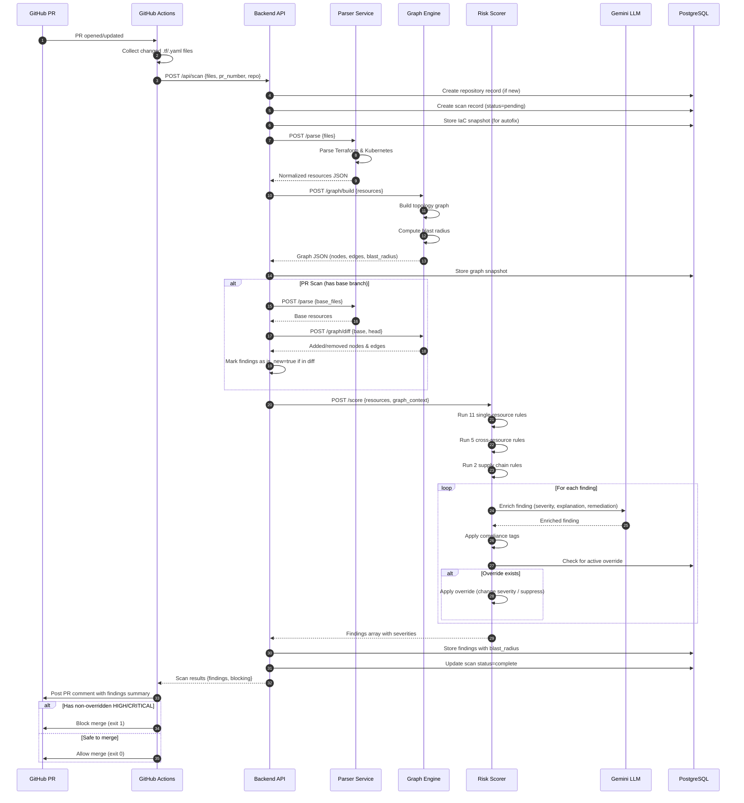

### Data Models & Relationships

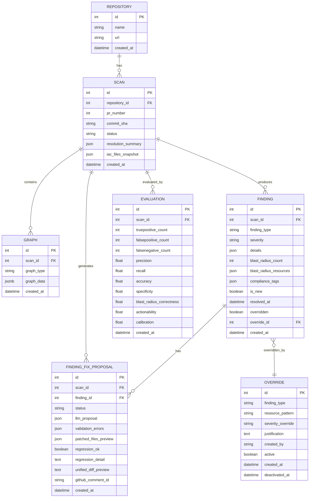

---

## Failure Systems & Resilience

NetGuard implements multiple layers of failure handling and resilience mechanisms to ensure reliable operation in production environments.

### 1. Database Connection Resilience

**Problem**: Database may not be immediately available during startup (e.g., in Docker Compose, db container initializing).

**Solution**: Retry logic with exponential backoff

```python
# services/api/main.py, services/graph_engine/main.py
@app.on_event("startup")
def _create_tables_with_retry():
    for attempt in range(1, 11):
        try:
            Base.metadata.create_all(bind=engine)
            logger.info("Database tables created/verified (attempt %d).", attempt)
            return
        except Exception as exc:
            logger.warning("create_all attempt %d failed: %s", attempt, exc)
            if attempt < 10:
                time.sleep(2)
    logger.error("Could not create tables after 10 attempts.")
```

- **Retries**: Up to 10 attempts with 2-second delays
- **Graceful Degradation**: Service starts even if DB is unavailable (requests will fail until DB is ready)
- **Logging**: Each attempt logged for debugging

### 2. Docker Health Checks

**Problem**: Downstream services might be running but not yet accepting connections.

**Solution**: Health check endpoints with restart policies

```yaml
# docker-compose.yml
healthcheck:
  test: ["CMD", "python", "-c", "import urllib.request; urllib.request.urlopen('http://localhost:8001/health')"]
  interval: 15s
  timeout: 5s
  retries: 5
restart: unless-stopped
```

- **Endpoints**: All services expose `GET /health` returning `{"status": "ok", "service": "name"}`
- **Dependencies**: API service depends on `db` health check before starting
- **Auto-Restart**: `unless-stopped` policy ensures services recover from crashes

### 3. Service Communication Error Handling

**Problem**: Inter-service HTTP calls can fail due to network issues, service unavailability, or timeouts.

**Solution**: Try-except wrappers with informative error messages

```python
# services/api/main.py
try:
    async with httpx.AsyncClient(timeout=120.0) as client:
        resp = await client.post(f"{PARSER_SERVICE_URL}/parse", json={"files": files})
        resp.raise_for_status()
        parsed = resp.json()
except httpx.HTTPError as exc:
    logger.error("Parser service call failed: %s", exc)
    raise HTTPException(status_code=502, detail=f"Parser service unavailable: {exc}")
```

- **Timeouts**: Generous 120s timeout for parsing/scoring operations
- **HTTP Status Propagation**: 502 Bad Gateway returned to client
- **Logging**: Full exception details logged for debugging

### 4. LLM API Failure Handling

**Problem**: Gemini API may be rate-limited, unavailable, or return malformed responses.

**Solution**: Graceful degradation to deterministic scoring

```python
# services/risk_scorer/llm/client.py
def enrich_finding(finding, resource, graph_context):
    api_key = os.getenv("GEMINI_API_KEY") or os.getenv("LLM_API_KEY")
    if not api_key:
        logger.info("No LLM API key — returning finding without enrichment.")
        return finding
    
    try:
        # ... LLM call logic
        return enriched_finding
    except Exception as exc:
        logger.warning("LLM enrichment failed for %s: %s", finding.finding_type, exc)
        return finding  # Return original finding without enrichment
```

- **Fallback**: If API key is missing or call fails, return deterministic finding as-is
- **No Blocking**: System continues to operate without LLM enrichment
- **Logging**: Warnings logged for monitoring and debugging

### 5. GitHub Webhook Signature Verification

**Problem**: Malicious actors could send fake scan requests to manipulate results.

**Solution**: HMAC signature verification

```python
# services/api/main.py
def _verify_signature(payload: bytes, signature: str, secret: str) -> bool:
    if not secret:
        return True  # Skip verification if no secret configured
    expected = "sha256=" + hmac.new(
        secret.encode(), payload, hashlib.sha256
    ).hexdigest()
    return hmac.compare_digest(expected, signature)

@app.post("/api/webhook/github")
async def github_webhook(request: Request):
    sig = request.headers.get("X-Hub-Signature-256", "")
    body = await request.body()
    if not _verify_signature(body, sig, NETGUARD_SECRET):
        raise HTTPException(status_code=401, detail="Invalid signature")
```

- **HMAC-SHA256**: GitHub-standard signature scheme
- **Constant-Time Comparison**: Prevents timing attacks
- **Optional**: Can be disabled for local development

### 6. Autofix Validation Pipeline

**Problem**: LLM-generated fixes might introduce syntax errors or new security vulnerabilities.

**Solution**: Multi-stage validation before presenting fix to user

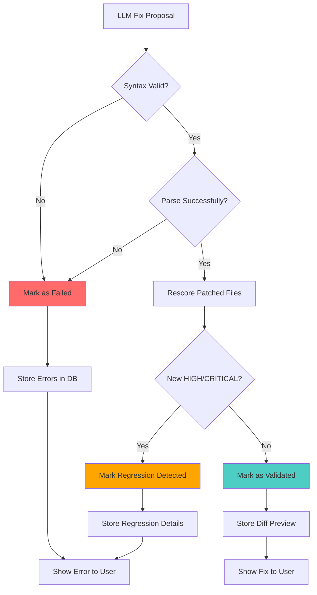

**Validation Stages**:
1. **Syntax Validation**: Attempt to parse patched Terraform files
2. **Resource Parsing**: Ensure resources can be normalized
3. **Regression Testing**: Rescore patched files and compare findings
4. **Security Gate**: Reject if new HIGH/CRITICAL findings introduced

### 7. Override Audit Trail

**Problem**: Security overrides can be abused if not tracked.

**Solution**: Immutable audit log with deactivation (not deletion)

```python
# services/database/models.py
class Override(Base):
    # ... fields ...
    created_by = Column(String(255), nullable=True)
    created_at = Column(DateTime(timezone=True), default=_utcnow)
    active = Column(Boolean, default=True)
    deactivated_at = Column(DateTime(timezone=True), nullable=True)
```

- **No Deletion**: Overrides are never deleted, only deactivated
- **Timestamps**: Creation and deactivation tracked
- **Justification Required**: Free-text field for explanation
- **Pattern Matching**: Overrides can be scoped to specific resources or globally (`*`)

### 8. Frontend Error Boundaries

**Problem**: JavaScript errors in graph visualization can crash the entire dashboard.

**Solution**: React error boundaries (implementation in `frontend/src/`)

- **Fallback UI**: Show error message instead of white screen
- **Graceful Degradation**: Other dashboard sections remain functional
- **Error Logging**: Capture errors for debugging

### 9. Rate Limiting & Backpressure

**Current Status**: Not implemented (suitable for production deployment)

**Future Enhancement**:
- API rate limiting (e.g., 100 requests/minute per IP)
- LLM request queuing (avoid overwhelming Gemini API)
- Background job processing for large scans (Celery/Redis)

### 10. Monitoring & Observability

**Implemented**:
- Structured logging (Python `logging` module)
- Health check endpoints (`/health` on all services)
- Evaluation metrics tracking (precision, recall, accuracy)

**Future Enhancement**:
- Prometheus metrics export
- Grafana dashboards
- Distributed tracing (OpenTelemetry)
- Error alerting (Sentry, PagerDuty)

---

## Database Schema

### Schema Design Principles

1. **Immutability**: Findings and overrides are never deleted, only marked as resolved/deactivated
2. **Audit Trail**: Timestamps on all records, resolution tracking, creator attribution
3. **Denormalization**: Blast radius and compliance tags stored in findings for fast queries
4. **Snapshots**: IaC file contents stored in scans for autofix replay
5. **Graph Persistence**: Full D3-compatible graph JSON stored as JSONB for visualization

### Table Descriptions

#### `repositories`
Tracks GitHub repositories being monitored.
- **Relationships**: One-to-many with scans

#### `scans`
Represents a single PR scan run.
- **Key Fields**:
  - `iac_files_snapshot`: JSON map of `{path: content}` for autofix
  - `resolution_summary`: JSON summary of how findings were resolved
  - `status`: `pending`, `complete`, `failed`
- **Relationships**: Many-to-one with repository, one-to-many with graphs/findings/evaluations

#### `graphs`
Serialized graph snapshots.
- **Key Fields**:
  - `graph_type`: `base` or `head` (for PR diffs)
  - `graph_data`: Full D3-compatible JSON (nodes, edges, metadata)
- **Storage**: PostgreSQL JSONB for efficient querying

#### `findings`
Security findings produced by risk scorer.
- **Key Fields**:
  - `finding_type`: e.g., `SSH_EXPOSED_TO_PUBLIC`
  - `severity`: `CRITICAL`, `HIGH`, `MEDIUM`, `LOW`
  - `blast_radius_count`: Number of reachable resources
  - `blast_radius_resources`: Array of resource IDs
  - `compliance_tags`: Array of framework tags (e.g., `["CIS_AWS", "NIST_AC"]`)
  - `is_new`: Boolean indicating if finding is new in this PR
  - `overridden`: Boolean indicating if override applied
- **Relationships**: Many-to-one with scan, many-to-one with override (optional)

#### `finding_fix_proposals`
LLM-generated fix proposals with validation results.
- **Key Fields**:
  - `status`: `pending`, `validated`, `failed`
  - `llm_proposal`: Raw LLM output (JSON with file edits)
  - `validation_errors`: Array of syntax/parsing errors (if failed)
  - `regression_ok`: Boolean indicating if fix passes regression testing
  - `unified_diff_preview`: Unified diff string for UI display
  - `github_comment_id`: GitHub API comment ID (if posted)

#### `overrides`
Override rules for accepting risks.
- **Key Fields**:
  - `finding_type`: Which finding type to override
  - `resource_pattern`: Glob/regex for resource ID matching (or `*` for all)
  - `severity_override`: New severity level (or `None` to suppress entirely)
  - `justification`: Free-text explanation
  - `active`: Boolean (deactivated overrides remain in DB for audit)

#### `evaluations`
Evaluation metrics for scan quality.
- **Key Fields**:
  - Legacy: `truepositive_count`, `falsepositive_count`, `falsenegative_count`, `precision`, `recall`
  - v2.0 Rubric: `accuracy`, `specificity`, `blast_radius_correctness`, `actionability`, `calibration` (all 1-5 scale)

---

## CI/CD Integration

### GitHub Actions Workflow

NetGuard integrates seamlessly into PR workflows via GitHub Actions, providing automated security gating.

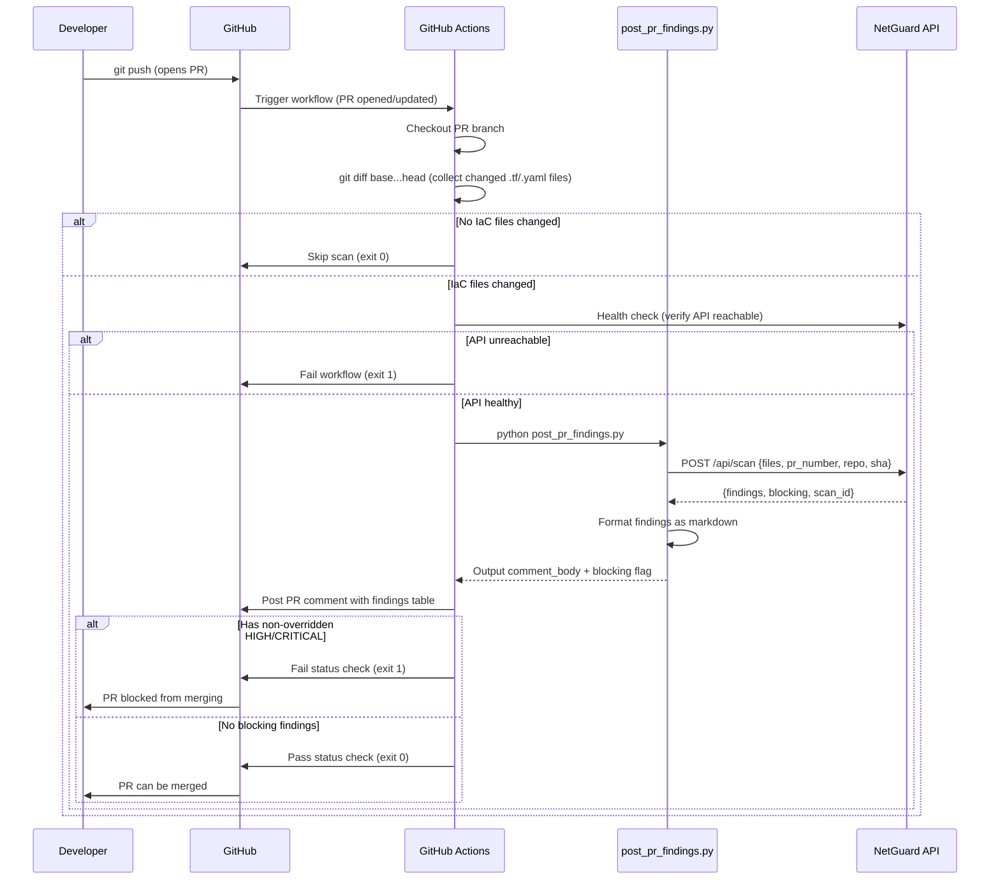

### Workflow Configuration

**File**: `.github/workflows/netguard.yml`

**Trigger**: PR events (`opened`, `synchronize`, `reopened`)

**Permissions**:
- `contents: read`: Read repository files
- `pull-requests: write`: Post PR comments
- `issues: write`: Create issue comments (PRs are issues in GitHub API)

**Required Secrets**:
- `NETGUARD_API_URL`: Public URL of NetGuard API (e.g., ngrok tunnel for dev, production URL for prod)
- `NETGUARD_SECRET`: HMAC secret for signature verification (optional but recommended)

**Environment Variables** (on API host, not in workflow):
- `GEMINI_API_KEY`: Gemini API key for LLM enrichment (optional)
- `GITHUB_TOKEN`: GitHub PAT for posting autofix comments (optional)

**Steps**:
1. **Checkout**: Fetch PR branch with full history (`fetch-depth: 0`)
2. **Collect Changed Files**: `git diff` between base and head, filter for `.tf`/`.yaml`/`.yml`
3. **Health Check**: Verify NetGuard API is reachable (fail fast if not)
4. **Run Scan**: Execute `scripts/post_pr_findings.py` with environment variables
5. **Post Comment**: Use `actions/github-script` to post formatted findings table
6. **Enforce Blocking**: Exit 1 if non-overridden HIGH/CRITICAL findings exist

### Scan Script: `scripts/post_pr_findings.py`

**Purpose**: Bridge between GitHub Actions and NetGuard API.

**Key Functions**:
- Read changed files from `$CHANGED_FILES` (newline-separated list)
- Read file contents from disk
- Call `POST /api/scan` with files, PR number, repo, SHA
- Format response as markdown table with severity badges, finding types, resources
- Output `comment_body` (for GitHub comment) and `blocking` (for merge decision) as GitHub Actions outputs
- Handle errors gracefully (API unavailable, invalid response, etc.)

**Example Comment Output**:

```markdown
## 🔒 NetGuard Security Scan Results

**Scan ID**: 42  
**Commit**: abc123def  
**Status**: ⚠️ BLOCKED - Critical findings detected

### Findings Summary
- 🔴 **CRITICAL**: 2
- 🟠 **HIGH**: 1
- 🟡 **MEDIUM**: 3
- 🟢 **LOW**: 0

### Critical Findings
| Type | Resource | Blast Radius | Compliance |
|------|----------|--------------|------------|
| SSH_EXPOSED_TO_PUBLIC | aws_security_group.web | 5 resources | CIS_AWS, NIST_AC, PCI_DSS |
| PUBLIC_DB_PORT_EXPOSED | aws_security_group.db | 12 resources | CIS_AWS, NIST_SC, PCI_DSS |

### High Findings
| Type | Resource | Blast Radius | Compliance |
|------|----------|--------------|------------|
| PRIVILEGED_EC2_TO_SENSITIVE_DB | aws_instance.admin | 3 resources | NIST_AC, PCI_DSS |

[View full scan details](https://netguard.example.com/scans/42)

---
⚠️ This PR is **blocked from merging** due to non-overridden HIGH or CRITICAL findings.  
To proceed, either fix the issues or create overrides with justifications.
```

---

## Technology Stack

### Backend Services

| Technology | Version | Purpose |
|------------|---------|---------|
| **Python** | 3.12 | Primary language for all backend services |
| **FastAPI** | Latest | REST API framework (high performance, async, OpenAPI) |
| **SQLAlchemy** | 2.x | ORM for database operations |
| **Pydantic** | 2.x | Data validation and schema definition |
| **httpx** | Latest | Async HTTP client for inter-service communication |
| **NetworkX** | Latest | Graph data structures and algorithms |
| **python-dotenv** | Latest | Environment variable management |
| **google-generativeai** | Latest | Gemini LLM integration |

### Data Layer

| Technology | Version | Purpose |
|------------|---------|---------|
| **PostgreSQL** | 14 | Primary relational database |
| **JSONB** | Native | Efficient storage of graphs and complex attributes |

### Frontend

| Technology | Version | Purpose |
|------------|---------|---------|
| **React** | 18 | UI framework |
| **Vite** | Latest | Build tool and dev server |
| **D3.js** | 7 | Graph visualization |
| **Axios** | Latest | HTTP client for API calls |
| **React Router** | Latest | Client-side routing |

### Infrastructure

| Technology | Version | Purpose |
|------------|---------|---------|
| **Docker** | Latest | Containerization |
| **Docker Compose** | v3.9 | Multi-container orchestration |
| **GitHub Actions** | Latest | CI/CD automation |

### Development Tools

| Tool | Purpose |
|------|---------|
| **pytest** | Unit and integration testing |
| **uvicorn** | ASGI server for FastAPI apps |
| **psycopg2** | PostgreSQL adapter for Python |

---

## Deployment Architecture

### Docker Compose Setup (Development & Demo)

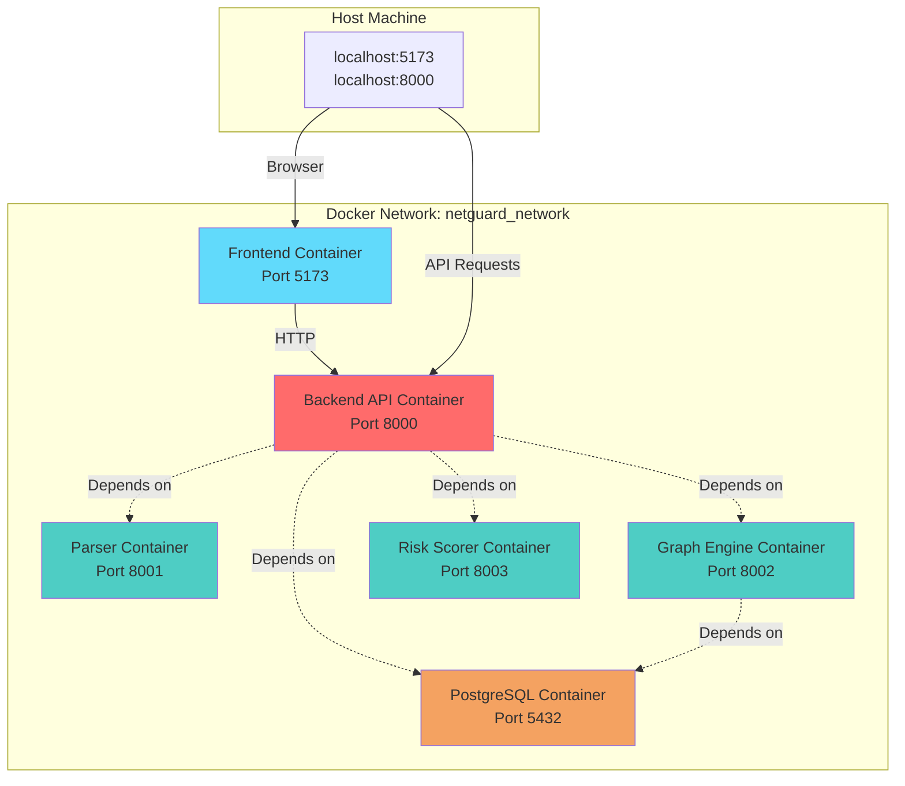

**Key Features**:
- **Isolated Network**: All containers communicate via `netguard_network` bridge
- **Health Checks**: Each service has health checks with retries
- **Dependency Management**: API waits for DB health before starting
- **Volume Persistence**: PostgreSQL data persisted in named volume `postgres_data`
- **Environment Configuration**: All services read from shared `.env` file
- **Auto-Restart**: `restart: unless-stopped` ensures resilience

**Commands**:
```bash
# Start all services
docker-compose up --build

# Stop all services
docker-compose down

# View logs
docker-compose logs -f api

# Rebuild single service
docker-compose up --build api
```

### Production Deployment (Future)

**Recommended Architecture**:

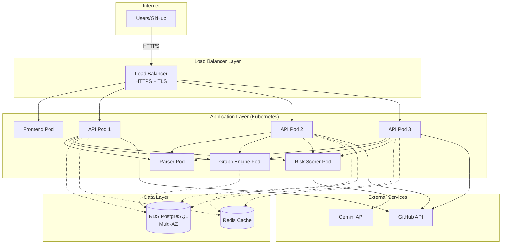

**Components**:
- **Load Balancer**: AWS ALB / GCP Load Balancer / NGINX
- **Container Orchestration**: Kubernetes (EKS, GKE, AKS)
- **Database**: Managed PostgreSQL (RDS, Cloud SQL) with read replicas
- **Caching**: Redis for scan result caching and rate limiting
- **Secrets Management**: AWS Secrets Manager / HashiCorp Vault
- **Monitoring**: Prometheus + Grafana, DataDog, or New Relic
- **Logging**: ELK Stack / Splunk / CloudWatch
- **CDN**: CloudFront / Cloud CDN for frontend static assets

**Scaling Strategy**:
- **Horizontal Scaling**: API pods scale based on CPU/memory (HPA)
- **Service Isolation**: Parser, Graph Engine, Risk Scorer run as separate deployments
- **Database**: Read replicas for scan history queries
- **Caching**: Redis for frequently accessed graphs and findings

---

## Appendix: Key Algorithms

### Blast Radius Computation

**Algorithm**: Breadth-First Search (BFS) from each node

```python
def compute_blast_radius(graph: nx.DiGraph, node_id: str) -> dict:
    """
    Compute all reachable nodes from node_id via directed edges.
    """
    if node_id not in graph:
        return {"count": 0, "resources": []}
    
    reachable = set()
    queue = [node_id]
    visited = {node_id}
    
    while queue:
        current = queue.pop(0)
        for successor in graph.successors(current):
            if successor not in visited:
                visited.add(successor)
                reachable.add(successor)
                queue.append(successor)
    
    return {
        "count": len(reachable),
        "resources": sorted(list(reachable))
    }
```

### Graph Diffing

**Algorithm**: Set comparison of nodes and edges

```python
def diff_graphs(base: nx.DiGraph, head: nx.DiGraph) -> GraphDiffResponse:
    """
    Compare two graphs and return added/removed nodes and edges.
    """
    base_nodes = set(base.nodes)
    head_nodes = set(head.nodes)
    
    added_nodes = list(head_nodes - base_nodes)
    removed_nodes = list(base_nodes - head_nodes)
    
    base_edges = set(base.edges)
    head_edges = set(head.edges)
    
    added_edges = [{"source": u, "target": v} for u, v in (head_edges - base_edges)]
    removed_edges = [{"source": u, "target": v} for u, v in (base_edges - head_edges)]
    
    return GraphDiffResponse(
        added_nodes=added_nodes,
        removed_nodes=removed_nodes,
        added_edges=added_edges,
        removed_edges=removed_edges,
    )
```

### Resource Normalization

**Parser**: Extract structured data from Terraform HCL

```python
def parse_terraform_resource(block_text: str) -> Resource:
    """
    Parse Terraform resource block into normalized format.
    Example: resource "aws_security_group" "web" { ... }
    """
    match = re.match(r'resource\s+"([^"]+)"\s+"([^"]+)"\s*{', block_text)
    resource_type = match.group(1)
    resource_name = match.group(2)
    
    # Extract attributes (ingress rules, CIDR blocks, etc.)
    attributes = extract_attributes(block_text)
    
    return Resource(
        resource_id=f"{resource_type}.{resource_name}",
        resource_type=resource_type,
        resource_name=resource_name,
        attributes=attributes,
        source_file="terraform/main.tf",
    )
```

---

## Summary

NetGuard is a production-ready IaC security platform that combines:
- **Automated Parsing** of Terraform and Kubernetes configurations
- **Graph-Based Analysis** for understanding resource relationships and blast radius
- **AI-Enriched Risk Scoring** using deterministic rules + Gemini LLM
- **Actionable Fix Proposals** with validation and regression testing
- **CI/CD Integration** for automated PR gating
- **Interactive Visualization** with D3.js force-directed graphs
- **Comprehensive Resilience** with health checks, retries, and graceful degradation

The system is designed for:
- **Security Teams**: Proactive vulnerability detection with minimal false positives
- **DevOps Engineers**: Automated security gates without blocking velocity
- **Compliance Auditors**: Built-in framework mapping and audit trails
- **Developers**: Clear remediation guidance with copy-paste fixes

NetGuard shifts security left, catching misconfigurations before they reach production, while providing the context and actionability needed to actually fix issues instead of just reporting them.
