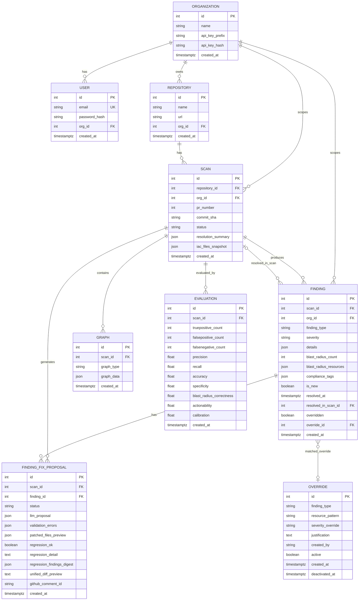
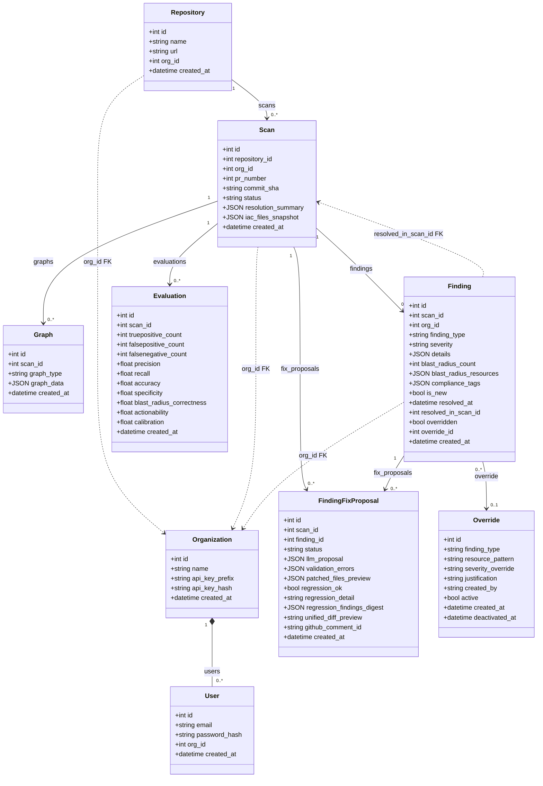
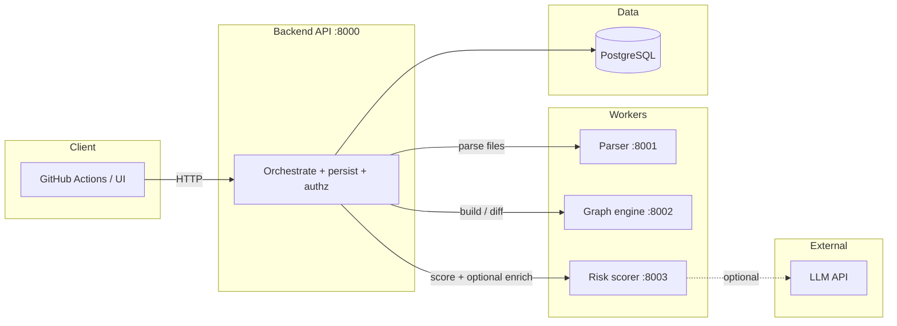
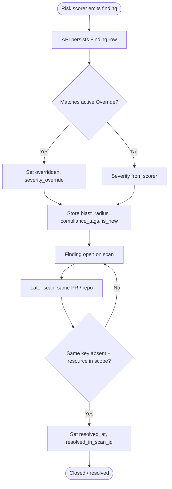

# Data model & design diagrams (Mermaid)

ER diagram, ORM **class diagram**, and extra **flowcharts** for reports and `ARCHITECTURE.md`. Sources: `services/database/models.py`, `migrations/003_auth.sql`.

---

## 1. Entity–relationship diagram (database)

Reflects **organizations** / **users** (multi-tenant), **org_id** on `repositories`, `scans`, and `findings`. `graph_type` values used in code include `head`, `diff`, and `resources` (not only `base`/`head`).

**Fig. D.1: ER diagram (NetGuard persistence layer)**

---

## 2. Class diagram (SQLAlchemy ORM)

Maps the same schema as **Python domain classes** in `services/database/models.py`. Suitable for object-oriented design sections.

**Fig. D.2: Class diagram (SQLAlchemy models)**

---

## 3. Flowchart — Multi-service scan orchestration (logical)

High-level view of **which service** owns each stage (complements the API-internal flowchart in [`LOW_LEVEL_DESIGN_DIAGRAMS.md`](./LOW_LEVEL_DESIGN_DIAGRAMS.md)).

**Fig. D.3: Multi-service scan orchestration flowchart**

---

## 4. Flowchart — Finding lifecycle (persisted row)

From scorer output through override matching to resolution on a later scan.

**Fig. D.4: Finding lifecycle flowchart**

---

## See also

- [**LOW_LEVEL_DESIGN_DIAGRAMS.md**](./LOW_LEVEL_DESIGN_DIAGRAMS.md) — §6.4 sequence diagrams, use cases, API scan flowchart.
- [**ARCHITECTURE.md**](./ARCHITECTURE.md) — narrative + older ER snippet (without org/user).
- [**SYSTEM_ARCHITECTURE_CONTEXT.md**](./SYSTEM_ARCHITECTURE_CONTEXT.md) — Level-0 context diagram.
