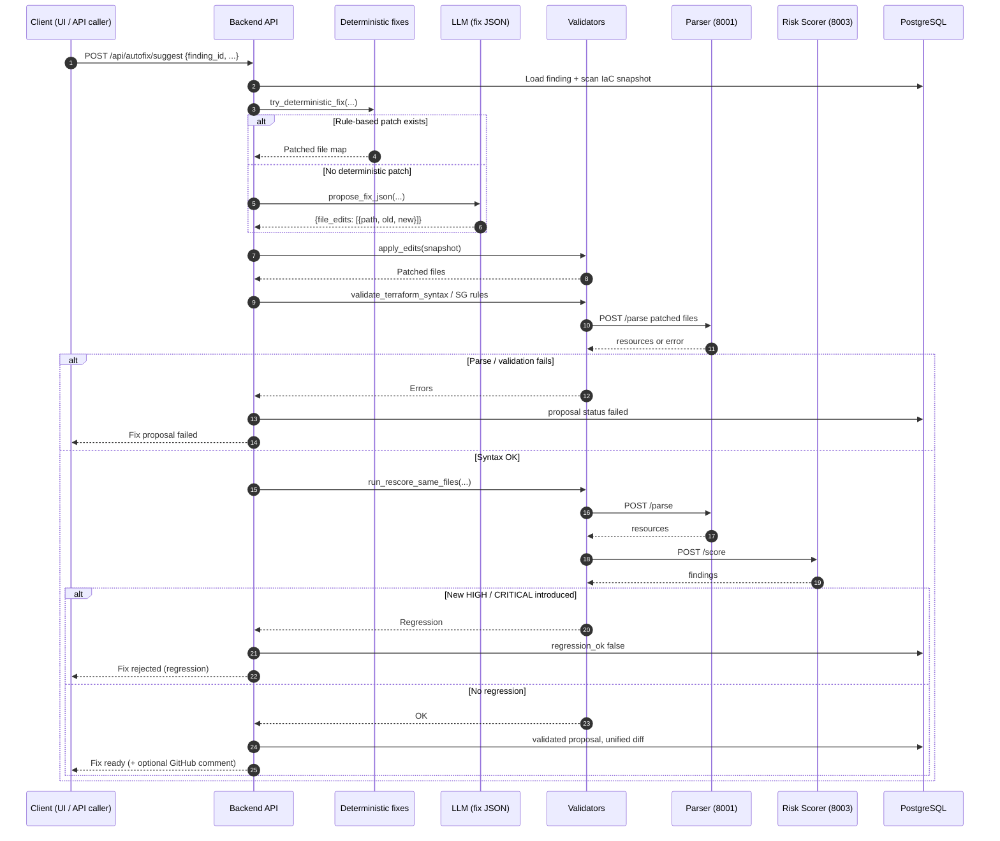
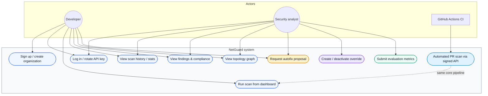

# Low-Level Design — Mermaid Figures (Chapter 6)

Figures for **§6.4 Low Level Design** (Flowchart and Sequence Diagrams). Render with any Mermaid-capable viewer (VS Code, GitHub, [mermaid.live](https://mermaid.live)).

---

## Figure 6.2 — Scan pipeline sequence diagram

End-to-end flow from **GitHub Actions** through **Backend API** orchestration to **PR comment** and merge gate. Aligned with `services/api/main.py` (`scan_iac`): JSON body with `files[]`, optional **HMAC** + `api_key` in body for CI; parser called per file; **graph merge** with prior scan on same PR when present; **overrides applied when persisting** findings in the API.

```mermaid
%%{init: {'theme': 'default'}}%%
sequenceDiagram
    autonumber
    participant GH as GitHub PR
    participant GHA as GitHub Actions
    participant Script as post_pr_findings.py
    participant API as Backend API
    participant DB as PostgreSQL
    participant PARSER as Parser (8001)
    participant GRAPH as Graph Engine (8002)
    participant SCORER as Risk Scorer (8003)
    participant LLM as LLM API

    GH->>GHA: PR opened / updated
    GHA->>GHA: Collect tracked .tf / .yaml / .yml
    GHA->>Script: Run with env (paths, tokens)
    Script->>API: POST /api/scan JSON + X-NetGuard-Signature<br/>body: files[], api_key, repo, pr, sha

    API->>API: Verify HMAC or X-API-Key + resolve org_id
    alt Auth invalid
        API-->>Script: 401
    else Auth OK
        API->>DB: Upsert repository; insert scan status=running
        loop Each IaC file
            API->>PARSER: POST /parse multipart file
            PARSER-->>API: resources[], module_sources
        end
        alt No resources parsed
            API->>DB: scan status=failed
            API-->>Script: 400
        else Resources OK
            API->>DB: Load previous_scan (same repo, PR) if any
            API->>API: Merge previous graph resources with current (merged head)
            API->>GRAPH: POST /graph/build merged resources
            GRAPH-->>API: head_graph nodes, edges, blast_radius
            opt Previous resources exist
                API->>GRAPH: POST /graph/diff {base: prev, head: merged}
                GRAPH-->>API: diff_payload newly_exposed, deltas
            end
            API->>API: Build graph_context for scorer
            API->>SCORER: POST /score {resources, graph_context}
            SCORER->>SCORER: Deterministic rules
            loop Optional enrichment
                SCORER->>LLM: Enrich finding
                LLM-->>SCORER: Explanations / severity refine
            end
            SCORER-->>API: findings[]
            API->>DB: Match overrides; persist findings + graphs<br/>(head, diff, resources); iac snapshot
            API->>DB: scan status=completed; resolution_summary
            API-->>Script: scan_id, summary, blocking
        end
    end

    Script-->>GHA: comment_body, blocking flag
    GHA->>GH: Post PR comment
    alt Non-overridden HIGH or CRITICAL blocking merge
        GHA->>GHA: exit 1 (merge blocked)
    else
        GHA->>GHA: exit 0
    end
```

**Fig. 6.2: Scan Pipeline Sequence Diagram**

---

## Figure 6.3 — Autofix validation sequence diagram

Autofix path: deterministic fix first, else LLM **JSON** proposal; **validators** parse and **rescore** patched snapshot.



**Fig. 6.3: Autofix Validation Sequence Diagram**

---

## Figure 6.4 — Use case diagram

Actors and major use cases (system boundary = NetGuard platform).



**Fig. 6.4: Use Case Diagram**

---

## Figure 6.5 — Scan pipeline flowchart (Backend API)

Control flow inside **`POST /api/scan`** orchestration (`scan_iac` in `services/api/main.py`), omitting generic exception handlers for brevity.

```mermaid
%%{init: {'theme': 'default'}}%%
flowchart TD
    START([POST /api/scan received]) --> PARSE_JSON[Parse JSON body + files list]
    PARSE_JSON --> AUTH{HMAC valid or<br/>X-API-Key + org?}
    AUTH -->|No| E401[/401 Unauthorized/]
    AUTH -->|Yes| REPO[Get or create Repository]
    REPO --> SCAN_ROW[Insert Scan status = running]
    SCAN_ROW --> LOOP[For each file: POST Parser /parse]
    LOOP --> HAS_RES{Any resources?}
    HAS_RES -->|No| FAIL400[Set scan failed → 400]
    HAS_RES -->|Yes| BUILD_GR[Build graph_resources from parsed]
    BUILD_GR --> PREV[Load previous scan for same PR + org]
    PREV --> MERGE[Merge previous + current graph resources]
    MERGE --> GBUILD[POST Graph /graph/build]
    GBUILD --> HAS_PREV{Previous resources<br/>non-empty?}
    HAS_PREV -->|Yes| GDIFF[POST Graph /graph/diff]
    HAS_PREV -->|No| CTX[graph_context = nodes, edges, exposure deltas]
    GDIFF --> CTX
    CTX --> SCORE[POST Risk Scorer /score]
    SCORE --> DOWN_OK{HTTP / JSON OK?}
    DOWN_OK -->|No| FAIL502[Set scan failed → 502/503]
    DOWN_OK -->|Yes| EACH_F[For each finding from scorer]
    EACH_F --> OVR[Match active Override rules]
    OVR --> NEWKEY[Compute is_new vs previous findings]
    NEWKEY --> BLAST[Attach blast_radius from graph nodes]
    BLAST --> SAVE_F[Add Finding row]
    SAVE_F --> MORE_F{More findings?}
    MORE_F -->|Yes| EACH_F
    MORE_F -->|No| RESOLVE[Mark resolved findings from prior scan if applicable]
    RESOLVE --> SAVE_G[Persist Graphs: head, diff, resources]
    SAVE_G --> SNAP[Save iac_files_snapshot + resolution_summary]
    SNAP --> DONE[scan status = completed, commit]
    DONE --> BLOCK{Any HIGH/CRITICAL<br/>and not overridden?}
    BLOCK -->|Yes| RESP_B[Return blocking = true]
    BLOCK -->|No| RESP_OK[Return blocking = false]
    RESP_B --> END([200 JSON response])
    RESP_OK --> END

    style START fill:#ecfdf5,stroke:#059669,color:#0f172a
    style END fill:#ecfdf5,stroke:#059669,color:#0f172a
    style E401 fill:#fee2e2,stroke:#dc2626,color:#0f172a
    style FAIL400 fill:#fee2e2,stroke:#dc2626,color:#0f172a
    style FAIL502 fill:#fee2e2,stroke:#dc2626,color:#0f172a
```



**Fig. 6.5: Scan Pipeline Flowchart (Backend API)**

---

## See also

- [**DATA_MODEL_MERMAID_DIAGRAMS.md**](./DATA_MODEL_MERMAID_DIAGRAMS.md) — ER diagram, ORM class diagram, orchestration & finding lifecycle flowcharts.
- [`ARCHITECTURE.md`](./ARCHITECTURE.md) — narrative architecture and older diagram variants.
- [`SYSTEM_ARCHITECTURE_CONTEXT.md`](./SYSTEM_ARCHITECTURE_CONTEXT.md) — Level-0 context diagram.
- [`MINI_PROJECT_REPORT_CONTEXT.md`](./MINI_PROJECT_REPORT_CONTEXT.md) — report-ready technical summary.
