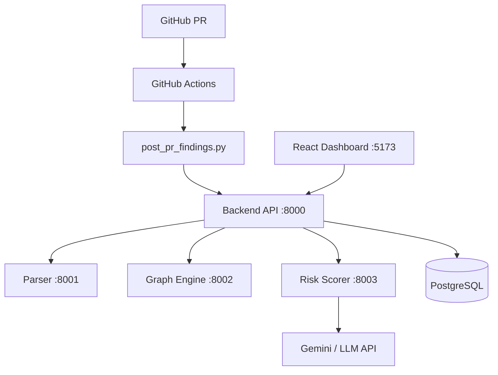

# Mini Project Report — Context Pack for Report Generation (NetGuard)

This document consolidates **everything needed to write the official CSP67 Mini Project report** for NetGuard. Paste this file (or its path) into Claude (or another assistant) together with the **master prompt at the end**.

**Project identity (fill placeholders for PDF front matter)**

| Field | Value |
|--------|--------|
| **Working project title** | **NetGuard — IaC Security Analyzer** (subtitle: Automated Network Security Analysis and Risk Scoring for Infrastructure-as-Code Pipelines) |
| **Institution** | M. S. Ramaiah Institute of Technology (Autonomous, affiliated to VTU), Bengaluru — 560054 |
| **Department** | Computer Science & Engineering |
| **Course** | CSP67: Mini Project |
| **Team label (in repo)** | Team 18 |
| **Students / USN / Guide** | *Replace with real names, USNs, guide name and designation in the final PDF* |
| **Academic window (from template)** | Certificate references *March–June 2025*; cover year shown as **2026** — align with department instructions |

---

## 1. Target report structure (department TOC)

The final report must follow this outline (page numbers are examples in the template):

- Certificate, Declaration, Acknowledgement  
- **Abstract** (max 500 words; **3 paragraphs**: motivation; scope/methodology; results/conclusions)  
- List of Figures, List of Tables  
- **1. Introduction** — general intro, problem statement, objectives, deliverables, current scope, future scope  
- **2. Project organization** — software process model, roles and responsibilities  
- **3. Literature survey** — intro, related work with citations, conclusion  
- **4. Project management plan** — Gantt chart, risk identification  
- **5. Software requirement specifications (SRS)** — purpose, scope, overall description (product perspective/features/environment), external interfaces (UI/hardware/software/communication), system features (functional, non-functional, use cases, use-case + activity/swimlane as needed)  
- **6. Design** — intro, **architecture** (structure/context diagram per chosen style), UI design, low-level design (flowcharts or sequence/state diagrams), conclusion  
- **7. Implementation** — tools, technologies, overall implementation view, **algorithms**, module-wise implementation, conclusion  
- **8. Testing** — intro, test cases  
- **9. Results & performance** — result snapshots  
- **10. Conclusion & future work** — findings, significance, limitations, future directions  
- **11. References**

When generating the report narrative, map NetGuard features explicitly into chapters 5–9.

---

## 2. Problem statement and motivation (for Ch. 1 & Abstract)

Infrastructure-as-Code (IaC) for **Terraform** and **Kubernetes** encodes real network exposure, identity, and data-plane risk. Misconfigurations (e.g. SSH/RDP or DB ports open to `0.0.0.0/0`, public buckets, permissive IAM, privileged containers, missing network policies) cause breaches and compliance failures. Static checks on isolated resources miss **topology context**: how resources connect, **blast radius**, and what a **pull request** newly introduces versus pre-existing risk.

**NetGuard** addresses this by: parsing IaC into a **normalized resource model**, building **directed topology graphs**, **diffing graphs at PR scope**, **scoring** with deterministic rules plus optional **LLM enrichment**, computing **blast radius**, offering **validated autofix** proposals, and **gating merges** in CI when non-overridden **HIGH/CRITICAL** findings exist.

---

## 3. Objectives and deliverables (mapping to TOC)

**Objectives**

1. Parse `.tf`, `.yaml`, `.yml` into a unified JSON resource representation.  
2. Build and persist network/topology graphs; support PR base vs head **diff**.  
3. Detect security findings using **rule phases**: single-resource, cross-resource (graph-assisted), supply-chain.  
4. Optionally enrich findings with an LLM (severity refinement ±1, explanation, remediation) without replacing deterministic truth.  
5. Provide **multi-tenant** org-scoped access via **API keys**; support **CI-signed** scan requests for GitHub Actions.  
6. Offer **autofix**: deterministic fixes first, else LLM JSON-mode file edits, with **validation + regression rescore**.  
7. Integrate **GitHub Actions**: comment on PR, optionally **block merge** on blocking severities.  
8. Deliver a **React + Vite** dashboard with **D3.js** graph visualization.

**Deliverables**

- Runnable **microservices** (FastAPI) + **PostgreSQL** + **frontend**; **Docker Compose** for full stack.  
- Workflow `.github/workflows/netguard.yml` and client script `scripts/post_pr_findings.py`.  
- Test suite under `tests/` (API, graph engine, risk scorer, autofix, contracts, parser integration).  
- Documentation: `README.md`, `ARCHITECTURE.md`, `AGENTS.md`.

---

## 4. High-level system architecture

### 4.1 Component summary

| Component | Port | Role |
|----------|------|------|
| Backend API | **8000** | Orchestration, persistence, auth, scan lifecycle, autofix, serves API for UI |
| Parser service | **8001** | IaC → normalized resources JSON |
| Graph engine | **8002** | Graph build, diff, blast radius, subgraphs; uses **NetworkX** |
| Risk scorer | **8003** | Rules + optional Gemini/LLM enrichment |
| Frontend | **5173** | React + Vite + D3.js |
| PostgreSQL | **5432** | Primary store |

**Inter-service calls**: API uses **`httpx`** (async) to call parser, graph engine, and risk scorer. Timeouts are generous (e.g. **120s**) for parse/score; failures surface as **502 Bad Gateway** with logging.

**External dependencies**

- **LLM**: `GEMINI_API_KEY` (preferred); legacy `LLM_API_KEY`; optional `GEMINI_MODEL` (default **gemini-2.5-flash** in project conventions). Alternative providers via `LLM_PROVIDER`: `gemini` (default), `groq`, `openai` with respective keys.  
- **GitHub**: optional `GITHUB_TOKEN` on API host for posting autofix diff comments on PR threads (separate from Actions `GITHUB_TOKEN` used for PR comments in the workflow).  
- **CI signing**: `NETGUARD_SECRET` — HMAC over request body; header pattern documented in README for `/api/scan` bypass of `X-API-Key`.

### 4.2 Reference architecture (Mermaid — reproduce as figure in report)



*(A fuller diagram with autofix and DB relationships appears in `ARCHITECTURE.md` in-repo.)*

### 4.3 Repository layout (implementation view)

```
mini-project/
├── services/api/           # FastAPI orchestrator
├── services/parser/        # FastAPI parser (Docker Compose target)
├── services/graph_engine/
├── services/risk_scorer/
├── services/autofix/       # deterministic fixes, validators, GitHub comment helpers
├── services/database/      # SQLAlchemy models
├── frontend/               # React + Vite + D3
├── docker/                 # Dockerfiles per service
├── docker-compose.yml
├── migrations/             # e.g. 003_auth.sql (orgs, users, org_id columns)
├── scripts/post_pr_findings.py
├── tests/                  # pytest: api, graph_engine, risk_scorer, autofix, parser, contracts
├── parser-service/         # Alternate FastAPI parser app + tests (schema/tests; compose uses services/parser)
├── requirements.txt
└── ARCHITECTURE.md, README.md, AGENTS.md
```

---

## 5. End-to-end data flow (scan pipeline)

1. **Trigger**: UI or GitHub Actions collects IaC file paths; workflow uses **`git ls-files`** for **all** tracked `.tf`/`.yaml`/`.yml` on PR head (full repo context for scoring).  
2. **API** creates/updates **repository** and **scan** records; stores **`iac_files_snapshot`** for autofix replay.  
3. **POST /parse** (parser): returns normalized resources (`resource_id`, `resource_type`, `resource_name`, `attributes`, `source_file`, etc.).  
4. **POST /graph/build** (graph engine): nodes/edges, blast radius per node, D3-oriented JSON.  
5. **PR mode**: parse **base** branch files if provided; **POST /graph/diff** yields added/removed nodes and edges — used to mark **`is_new`** on findings.  
6. **POST /score** (risk scorer): runs rules; optional LLM enrichment; compliance tags; overrides applied.  
7. **Persistence**: graphs in **JSONB**; findings with blast radius and compliance arrays.  
8. **Response to CI**: blocking flag if any **non-overridden HIGH or CRITICAL** finding; PR comment markdown from script output.

---

## 6. Risk scoring (technical detail for Ch. 6–7)

### 6.1 Rule phases

- **Phase 1 — Single-resource (11 types)**: e.g. `SSH_EXPOSED_TO_PUBLIC`, `RDP_EXPOSED_TO_PUBLIC`, `PUBLIC_DB_PORT_EXPOSED`, `ALL_PORTS_OPEN`, `HTTP_WITHOUT_HTTPS`, `PUBLIC_S3_BUCKET`, `PERMISSIVE_IAM_POLICY`, `UNENCRYPTED_STORAGE`, `MISSING_NETWORK_POLICY`, `PRIVILEGED_CONTAINER`, `UNAUTHENTICATED_SERVICE`.  
- **Phase 2 — Cross-resource (5)**: e.g. `INTERNET_EXPOSED_ADMIN_EC2`, `PRIVILEGED_EC2_TO_SENSITIVE_DB`, `PUBLIC_CHAIN_TO_DATABASE`, `OVERPERMISSIVE_SG_CHAIN`, `LATERAL_MOVEMENT_VIA_SG`.  
- **Phase 3 — Supply chain (2)**: `MUTABLE_DOCKER_IMAGE`, `MISSING_DEPENDENCY_LOCK`.

### 6.2 Severities

**CRITICAL**, **HIGH**, **MEDIUM**, **LOW**. Policy: **deterministic rules are authoritative**; LLM may adjust **± one level** for enrichment when enabled.

### 6.3 Compliance tagging

Findings carry framework tags such as **CIS_AWS**, **NIST_AC**, **NIST_SC**, **NIST_SA**, **PCI_DSS**, **SOC2_CC** (details in `ARCHITECTURE.md`).

### 6.4 Overrides

Pattern-based overrides (resource patterns / finding type), optional severity change or suppression; **audit trail** — deactivate, do not delete; stored with creator and timestamps.

---

## 7. Graph engine (algorithms for Ch. 7)

- **Blast radius**: reachability from a node in a **directed** graph (BFS-style propagation over successors) — count + list of reachable resource IDs.  
- **Graph diff**: set differences on node sets and edge sets between base and head graphs.  
- **API examples**: `/graph/build`, `/graph/diff`, `/graph/store`, `/graph/{id}`, `/graph/blast-radius`, `/graph/subgraph`, `/graph/neighbors`.

---

## 8. Autofix pipeline (design + implementation)

1. User or workflow requests fix for a **finding** (`POST /api/autofix/suggest` pattern).  
2. **Deterministic** module tries rule-based patches (e.g. restrict CIDRs, enable encryption, missing tags).  
3. Else **LLM** (`fix_client`, JSON-mode structured output) proposes `file_edits` (`path`, `old`, `new`).  
4. **Validators** apply edits to snapshot; **Terraform/K8s syntax** and **parse** validation via parser service.  
5. **Regression check**: rescore patched files — if new **HIGH/CRITICAL** appear, mark regression not OK.  
6. Store **unified diff**, validation errors, `github_comment_id` if posted.

---

## 9. Security, auth, and multi-tenancy

- **Signup / login**: bcrypt password hashes in `users`; **organizations** with **API keys** — **hashed at rest**; key prefix for lookup. Login **rotates** API key (plaintext shown once).  
- **Requests**: **`X-API-Key`** on `/api/*` (frontend stores in `localStorage` and attaches in `frontend/src/api.js` via `fetch`).  
- **CI**: valid **HMAC signature** header on scan POST; body includes org **`api_key`** so tenant is resolved without browser session.  
- **Data isolation**: `org_id` on repositories, scans, findings (see `migrations/003_auth.sql`).  
- **Resilience**: DB **create_all** retries on API/graph startup; Docker **healthchecks**; LLM failures **degrade** to non-enriched deterministic findings.

---

## 10. CI/CD (GitHub Actions)

**File**: `.github/workflows/netguard.yml`

- **Triggers**: `pull_request` (`opened`, `synchronize`, `reopened`).  
- **Permissions**: `contents: read`, `pull-requests: write`, `issues: write`.  
- **Steps**: checkout with history → collect all IaC paths → **GET** API `/health` (fail if unreachable) → `python scripts/post_pr_findings.py` → post comment via `actions/github-script` → **fail job** if `blocking == true` for non-overridden HIGH/CRITICAL.  
- **Secrets (customer-facing)**: `NETGUARD_API_URL`, `NETGUARD_SECRET`, `NETGUARD_API_KEY`, optional `NETGUARD_UI_URL`.

---

## 11. Database (SRS / design)

Core entities (ORM / ER narrative):

- **repositories**, **scans** (status, `iac_files_snapshot`, `resolution_summary`, PR metadata)  
- **graphs** (JSONB graph payloads, base/head types as applicable)  
- **findings** (type, severity, details JSON, blast radius fields, compliance tags, `is_new`, override linkage)  
- **finding_fix_proposals** (status, LLM proposal JSON, validation errors, diff preview, regression flags, GitHub comment id)  
- **overrides**  
- **evaluations** (precision/recall metrics and extended rubric fields)  
- **organizations**, **users** (auth migration)

Principles: snapshots for replay, JSONB for graphs, audit-friendly overrides.

---

## 12. Technology stack (accurate to repo; use in Ch. 7)

**Backend**

- Python **3.12**, **FastAPI**, **Uvicorn**, **SQLAlchemy 2.x**, **Pydantic 2.x**, **httpx**, **NetworkX**, **python-dotenv**, **psycopg2-binary**, **bcrypt**, **google-genai** (requirements list; LLM integration per `services/risk_scorer/llm/`).  
- IaC parsing uses **python-hcl2** and **PyYAML** where applicable.

**Frontend** (`frontend/package.json`)

- **React 19.x**, **React DOM 19.x**, **Vite 7.x**, **React Router DOM 7.x**, **D3 7.x**, **lucide-react** icons.  
- HTTP: native **`fetch`**, not Axios (centralized in `frontend/src/api.js`).

**Data / ops**

- **PostgreSQL 14** (Compose image).  
- **Docker Compose** v3.9, bridge network, named volume for Postgres data.

**Testing**

- **pytest**; suites including `tests/api/`, `tests/test_graph_engine/`, `tests/risk_scorer/`, `tests/autofix/`, `tests/parser/`, `tests/contracts/`.

**Note:** `README.md` contains an **implementation phases** table that may read as “Pending” — treat it as **stale**; the codebase implements the pipeline described above and in `ARCHITECTURE.md`. Similarly `ARCHITECTURE.md` mentions **React 18** in one table; **package.json** specifies **React 19** — prefer **package.json** for the report.

---

## 13. Frontend features (SRS / UI design)

- **Login / Signup**, **Settings** (API key regeneration), **Dashboard** (stats, recent scans), **Scan history**, **Scan detail** (findings, overrides, propose fix, optional GitHub comment action), **Scan graph** (D3 force-directed layout), **Run scan** flows.  
- Graph UX: severity coloring, zoom/pan, node inspection, legend.

---

## 14. Failure handling and limitations (for Ch. 10)

**Implemented**

- Startup DB retries; health checks; LLM optional; safe defaults on parse/score errors; autofix validation gate.

**Documented future / not implemented**

- API rate limiting, background queue for large scans, Redis cache, Prometheus/Grafana, full production K8s reference deployment (described as future in `ARCHITECTURE.md`).

---

## 15. Suggested figures/tables for the report

- Context diagram (section 4.2).  
- Sequence diagram: full scan (from `ARCHITECTURE.md`).  
- Sequence diagram: autofix validation.  
- ER diagram (entities in section 11).  
- Gantt: propose phases — parser+graph MVP → scorer+LLM → API+DB → frontend → CI gate → hardening/tests.  
- Test-case table: map pytest modules to requirements (e.g. graph diff, blast radius, rule hits, autofix regression).

---

## 16. Canonical citations “hooks” for literature survey

When writing Ch. 3, relate work to: IaC security static analysis, graph-based attack path analysis, LLM-assisted secure code review (with caveats), supply-chain security for containers, CIS/NIST/PCI mappings, PR-driven shift-left security, and policy-as-code gating — **add real peer-reviewed and vendor-neutral references** in the final **References** section (this context pack does not insert formatted bibliography entries).

---

# Master prompt for Claude (paste below instructions)

Use the following prompt **after** providing this entire file as context.

---

## PROMPT — Generate the CSP67 Mini Project Report (NetGuard)

You are writing a **complete academic Mini Project report** for **B.E. Computer Science & Engineering**, course **CSP67**, institution **M. S. Ramaiah Institute of Technology (VTU-affiliated)**, for the project **NetGuard — Automated IaC Security Analysis with Graph-Aware Risk Scoring and CI Gating**.

**Inputs**

1. The full contents of the document **“Mini Project Report — Context Pack for Report Generation (NetGuard)”** above (all sections).  
2. The department’s required **structure and chapter titles** given in **Section 1** of that pack.  
3. Optional: student names, USNs, guide name, designation — if missing, use clearly marked placeholders `<<Student Name>>`, `<<USN>>`, `<<Guide Name>>`.

**Output requirements**

1. Produce **Markdown** (or plain text structured for Word/LaTeX paste) with **all chapters 1–11**, using the **exact chapter numbering and headings** from the department TOC in Section 1, adapted to NetGuard’s actual work.  
2. **Abstract**: maximum **500 words**, exactly **3 paragraphs** as specified.  
3. **Architecture & design (Chapter 6)**: include **at least one** structural/context architecture diagram (you may use **Mermaid** syntax) and explain **microservices**, **data flow**, and **PostgreSQL** persistence.  
4. **Implementation (Chapter 7)**: describe **algorithms** (graph build, diff, blast radius BFS, scan orchestration, autofix validation/regression) and **modules** matching the repository layout.  
5. **SRS (Chapter 5)**: include **functional** and **non-functional** requirements, **use cases** (signup, scan, view graph, override, autofix, CI merge block), and **interfaces** (REST, GitHub Actions, LLM API).  
6. **Testing (Chapter 8)**: provide a **table of test cases** mapped to features; mention **pytest** and major test areas.  
7. **Results (Chapter 9)**: describe **representative outcomes** (e.g. blocking PR on HIGH/CRITICAL, dashboard snapshots narrative) — use plausible example findings consistent with the rule names in the context pack if screenshots are not available.  
8. **Conclusion (Chapter 10)**: include **limitations** (LLM cost/availability, parser coverage, no rate limiting) and **future work** (K8s HA deployment, caching, more clouds).  
9. **References (Chapter 11)**: include **at least 8** credible citations in a consistent format (IEEE or ACM style).  
10. **Tone**: formal, third person (“the system”, “the authors”), suitable for submission. **Do not invent features** not supported by the context pack; you may distinguish “implemented” vs “planned” using the limitations section.

Begin with the **title page text**, then **Certificate**, **Declaration**, **Acknowledgement** boilerplate adapted to NetGuard and placeholders, then proceed through **Abstract** and Chapters **1–11**.

---

*End of context pack.*
