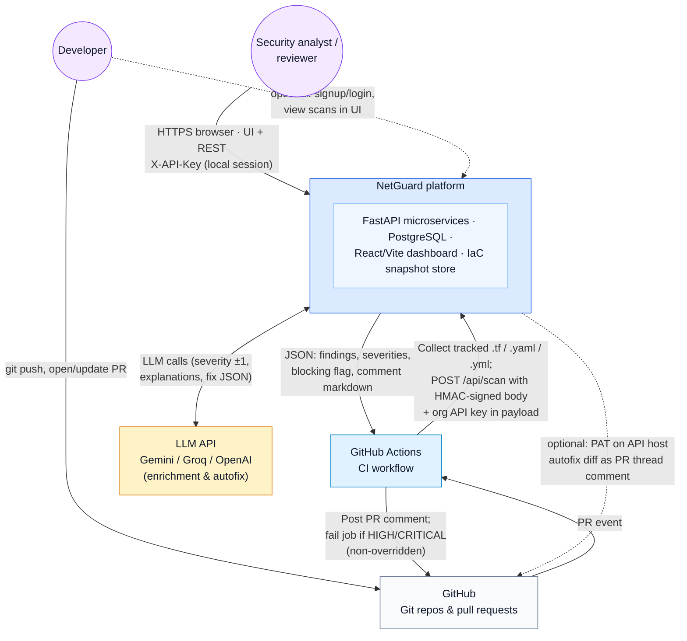

# NetGuard — System context diagram (Level 0)

This is a **system context** view: NetGuard is shown as one logical system with **external actors** and **external software** it depends on. For internal microservices (API, parser, graph engine, risk scorer, database, frontend), see [`ARCHITECTURE.md`](./ARCHITECTURE.md).

## Context diagram (Mermaid)

## Legend (narrative)

| Flow | Meaning |
|------|---------|
| **Developer → GitHub** | Changes land as commits; PRs trigger review and CI. |
| **GitHub Actions → NetGuard** | Workflow `netguard.yml` runs `scripts/post_pr_findings.py`, which calls the hosted **Backend API** over HTTPS with **HMAC** (`NETGUARD_SECRET`) and embeds the org **`api_key`** so scans are tenant-scoped without a browser session. |
| **NetGuard → GitHub Actions** | API returns structured results; the job posts a summary comment and may **exit non-zero** to block merge when policy requires it. |
| **Analyst / developer → NetGuard** | **Frontend** (e.g. port 5173) talks to the **Backend API** (e.g. port 8000) with **`X-API-Key`** after signup/login. |
| **NetGuard ↔ LLM** | **Risk scorer** enriches deterministic findings; **autofix** may request structured fix proposals. Without keys, rules still run (degraded mode). |
| **NetGuard ⇢ GitHub (dashed)** | Optional **`GITHUB_TOKEN`** on the API server: post validated autofix diffs to the PR (separate from Actions’ token used for the scan summary comment). |

## See also

- High-level component architecture: [`ARCHITECTURE.md`](./ARCHITECTURE.md) — *System Architecture* and *Deployment Architecture* sections.
- Report-oriented summary: [`MINI_PROJECT_REPORT_CONTEXT.md`](./MINI_PROJECT_REPORT_CONTEXT.md).
